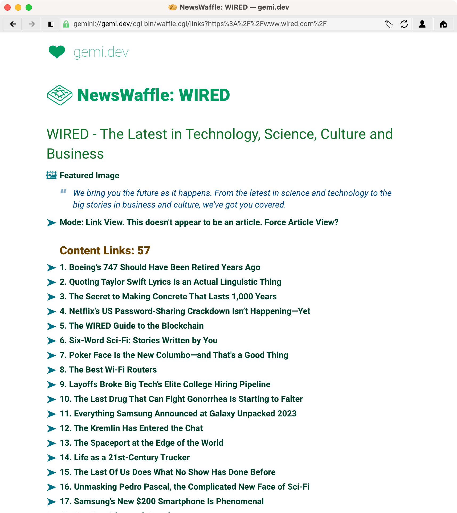
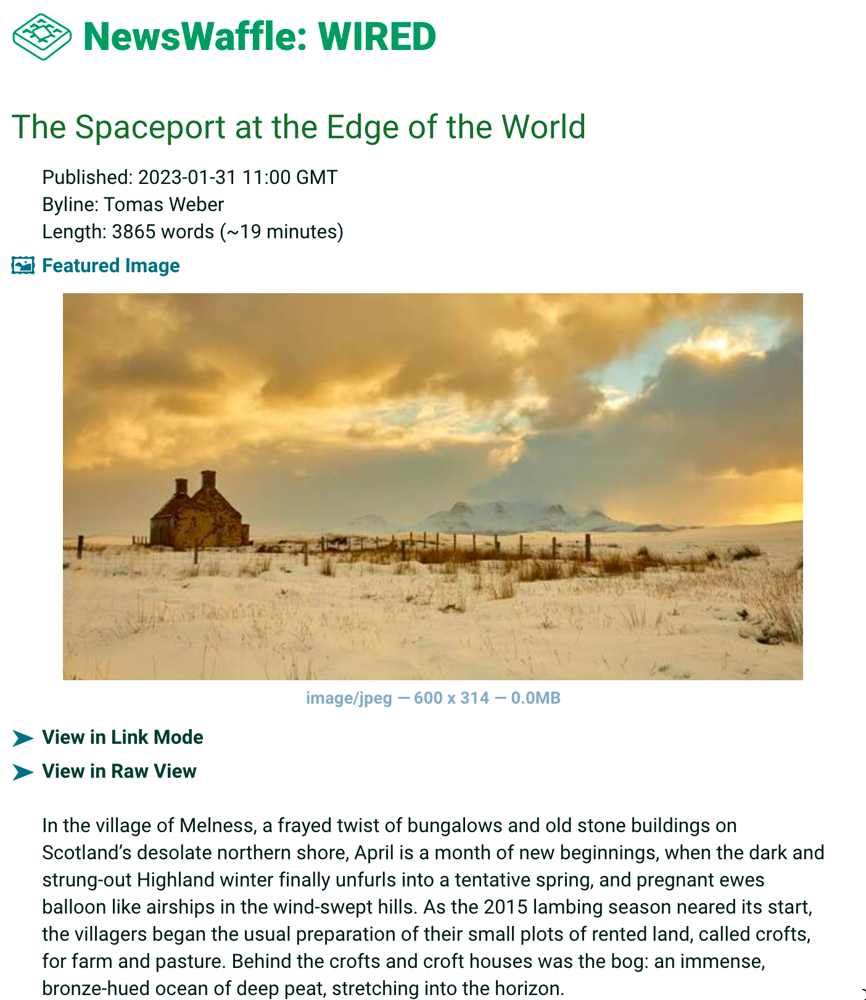

# NewsWaffle

NewsWaffle is a [Gemini](https://en.wikipedia.org/wiki/Gemini_(protocol)) gateway to public news websites, allowing you to get lists of current news articles, and read those news articles, all from inside Gemini.

Instead of only being able to read specific "text-only" or "lite" versions of news sites, NewsWaffle works with nearly any news site.

NewsWaffle also proxies images from the articles, resizing and converting them to be appropriately sized for Gemini.

[Changelog](Changelog.txt)

## Demo

A hosted version of NewsWaffle is available at: **gemini://gemi.dev/cgi-bin/waffle.cgi**

NewsWaffle runs as a CGI. While you can run it on any web server, it emits gemtext markup, so it's best run on a gemini server.

## Why?

* Modern news sites are user hostile, full of pop-ups, nag-walls, and intrusive ads that profile you and sell that to the highest bidder.
* Modern news sites are BLOATED, wasting time and data. Even the HTML itself is bloated, being hundreds of kilobytes in size when the actual article content is only a few kilobytes.
* Modern news sites are slow. Who has time for that nonsense?

NewsWaffle helps with all of this. JavaScript, cookies, and tracking pixels are all excluded, so you aren't being tracked. NewsWaffle optimizes the HTML much smaller gemtext. You can look at the bottom of NewsWaffle to see how much smaller the content is. Saving of 95% or more is common.

